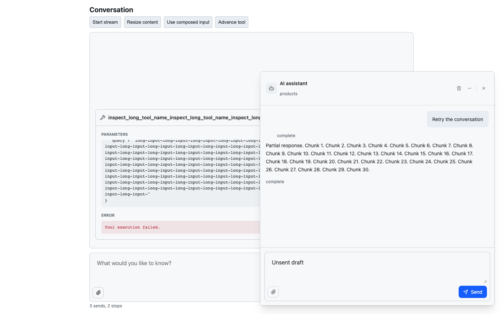
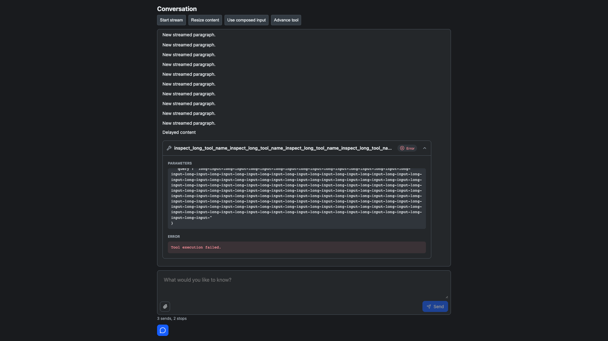
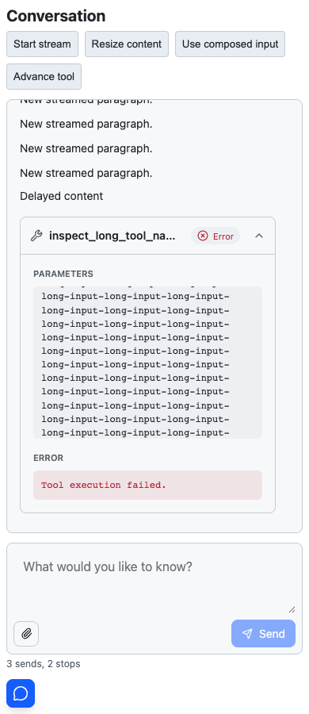

# AI Elements Interaction Polish

## Scope

JTBD: send a message, follow a streamed response, inspect tool results and long
Markdown, stop or retry a failed run, and read earlier messages without losing
the reading position on desktop or mobile.

Keep the existing component API and conversation hierarchy. Use progressive
disclosure for tool details and retain drafts on failure. Do not replace the
Markdown engine, add a backend, redesign unrelated components, or publish a
release.

Implementation is split into disjoint input, content, and conversation scopes.
The owner integrates the changes and runs browser acceptance; an independent
review checks the final diff.

## Acceptance

```gherkin
Scenario: Follow streamed and delayed content
  Given a conversation positioned at its latest message
  When streaming text or delayed rendered content grows
  Then the latest content stays visible
  But scrolling up pauses automatic following until the user returns to latest

Scenario: Send, stop, and retry
  Given either a default or composed input with a draft
  When submission is pending or the response is streaming
  Then duplicate sends are blocked and the available stop action cancels the run
  And a failed submission preserves the draft and attachments for retry

Scenario: Compose safely
  Given a disabled input or active IME composition
  When Enter, paste, or file drop occurs
  Then no unintended submission or attachment mutation happens
  And a draft edited during an async submission is retained

Scenario: Read messages and Markdown on mobile
  Given a narrow viewport with long text, tables, and fenced code
  When Markdown streams and completes
  Then prose wraps and wide content scrolls inside its own region
  And code content is preserved and controls remain reachable

Scenario: Inspect tool progress and failures
  Given a tool changes from pending to running to completed or failed
  When the user expands its details with keyboard or pointer
  Then its state and result remain readable without widening the page
  And approval controls remain explicit and error output is distinguishable
```

## Verification

- 260 component tests and four maintenance-script tests passed.
- Seven static CSS artifact tests passed.
- Root, surface, and flow typechecks passed with no errors or warnings; lint
  and whitespace checks passed.
- Eight real Chromium combinations passed, including clipboard copy, IME
  composition, native tool disclosure, keyboard scrolling, stopped-run retry,
  draft retention, and local overflow checks.
- Independent review findings were reproduced and fixed: clear-history follow,
  approval-run retry before/after restore, unavailable restored attachments,
  and disabled forms claiming global drop events.
- Whole-workspace tests passed, including SSR and router integration.
- Workspace package builds, packed consumers, example build, and bundle budgets
  passed. No release or deployment is part of this change.

| Group | Covered States |
| --- | --- |
| Conversation | Initial history, streaming, delayed resize, paused reading, return to latest, clear |
| Message | Long prose, narrow width, wrapped actions, failed/stopped retry, preserved new draft |
| Input | Default/composed, empty, pending, streaming, stop, error retry, IME, disabled, file drop |
| Tool | Pending, running, complete, error, collapsed/expanded, keyboard scroll, approval |
| Markdown | Lists, wide tables, long code, incomplete fences, inline HTML code, clipboard |

### Browser Acceptance

The deterministic fixture uses the real components and simulated providers; it
does not contact an AI backend. The matrix covers light/dark at 1440x900,
1920x1080, 390x900, and 320x900. Screenshots are written to
`output/playwright/interaction-*.png`.

From the repository root, build the package and start the fixture:

```sh
bun run --cwd packages/ai-elements build
bunx vite --config packages/ai-elements/test/vite.config.ts
```

With Playwright CLI available, open the fixture and run the recorded acceptance:

```sh
playwright-cli --session ai-interactions open http://127.0.0.1:5199/packages/ai-elements/test/interaction.html
playwright-cli --session ai-interactions run-code "$(sed 's/^export default //' packages/ai-elements/test/interaction.browser.mjs)"
playwright-cli --session ai-interactions close
```

### Evidence




