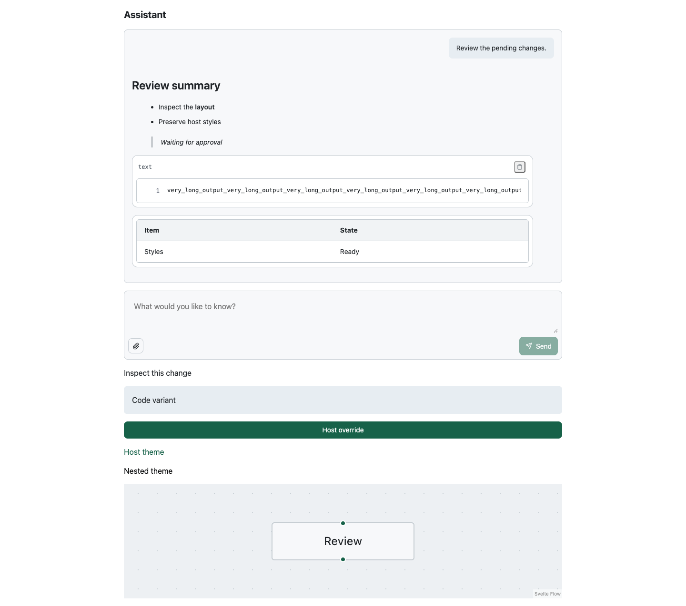
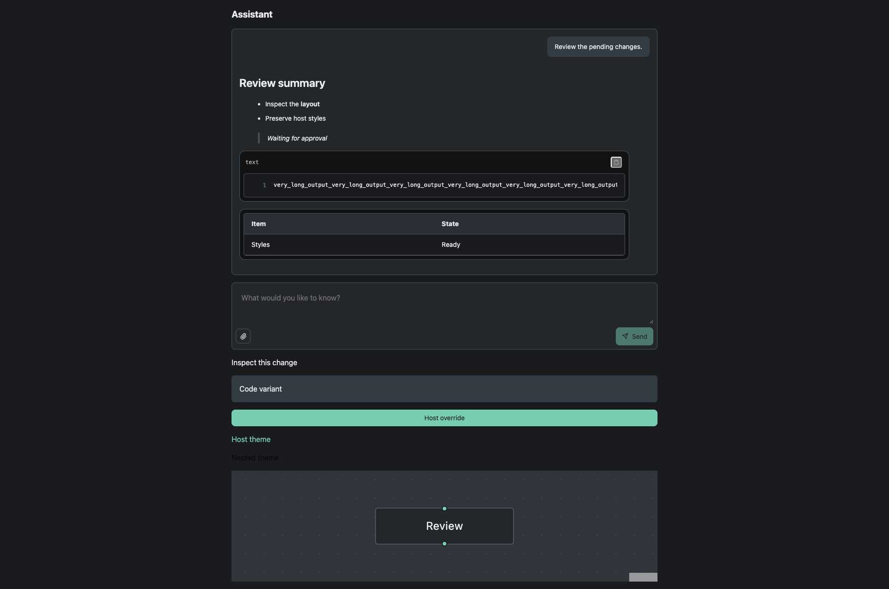

# AI Elements Static CSS

## PM Gate

JTBD: consume AI conversation components without requiring the host to install
a Tailwind plugin or scan dependency source files.

Anti-goals: no broad class renaming, workflow redesign, backend changes,
dependency on `@svadmin/ui`, or replacement of Streamdown/SvelteFlow.

Keep the existing conversation hierarchy, stream state, prompt actions, and
progressive disclosure unchanged. This change owns stylesheet delivery only.

```gherkin
Scenario: Plain CSS host
  Given a Svelte application without a Tailwind plugin
  When it imports ai.css and renders conversation and Markdown content
  Then layout and Markdown utility styles are available

Scenario: Host customization
  Given a Tailwind host with custom theme tokens
  When it imports ai.theme.css and overrides a control utility
  Then the override wins and nested semantic themes remain functional

Scenario: Streaming and failure
  Given an assistant response being streamed
  When the response finishes or fails
  Then existing status and retry behavior remains unchanged

Scenario: Independent components
  Given a host imports Code or Canvas through a component subpath
  When it builds for the browser and SSR
  Then the required styles remain available without importing @svadmin/ui
```

## Validation Matrix

| Area | States |
| --- | --- |
| CSS | Plain entry, theme entry, Tailwind host |
| Layout | Desktop and mobile; long Markdown/code content |
| Theme | Light/dark, nested semantic variables, host overrides |
| Conversation | Empty, streaming, complete, error |
| Dependencies | Streamdown utility coverage, SvelteFlow component stylesheet |
| Packaging | Root/subpath exports, CSS side effects, SSR consumer |

Tailwind remains a build tool. Streamdown still depends transitively on
tailwind-merge. Only ai-elements' runtime variant dependencies are removed.
tailwind-variants remains a development dependency for the public helper's
consumer-extension regression tests.

## Verification

- 171 component tests and four maintenance-script tests.
- Seven CSS artifact tests: standalone output, dependency utility coverage,
  deterministic builds, host extension, theme aliases, and export retention.
- Eighteen real Chromium combinations: plain/theme/Tailwind host entries,
  1440x900 / 1920x1080 / 390x900 viewports, and light/dark themes.
- Browser checks cover Markdown lists and long code blocks, send/stop actions,
  host utility overrides, nested themes, Code colors, and SvelteFlow styles.
- Workspace tests, package builds, typecheck, lint, SSR/packed consumers, and
  example build/bundle-budget checks passed locally.

The screenshots show the real `StaticCssHarness.svelte` fixture using the plain
CSS entry. They are full-page captures at the named browser viewport sizes.



