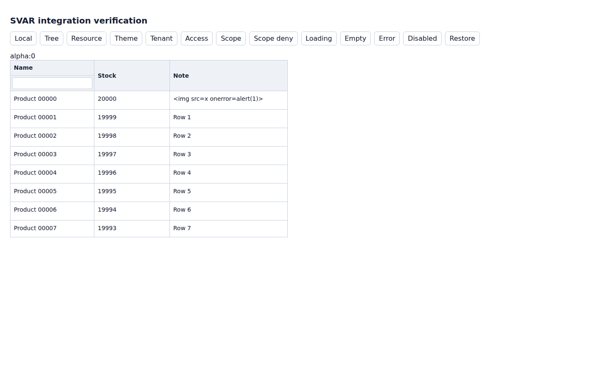
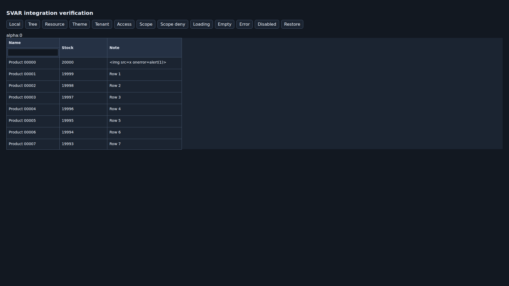

# SVAR DataGrid 评估与可选接入

评估日期：2026-09-19。实际验证版本：`@svar-ui/svelte-grid@2.7.3`、Svelte `5.56.10`。

## 结论与范围

采用 **可选的只读适配组件**，暂不替换 `AutoTable`、`VirtualTable` 或 `TreeTable`。SVAR 负责网格布局、本地排序过滤、虚拟滚动和树展开；资源契约、服务端请求、缓存、租户和访问检查仍由 svadmin 负责，没有增加第二套 REST 数据层。

两个组件通过已有深导出使用，不进入 UI 根 barrel：

- `@svadmin/ui/components/SvarDataGrid.svelte`：传入已授权的记录和显式列配置，可选择本地或受控服务端查询模式。
- `@svadmin/ui/components/SvarResourceTable.svelte`：读取现有 AdminContext 的资源定义，连接 `useResourceContract`、`useCan` 和 `useList`，提供分页、刷新及列排序/文本过滤。

宿主显式注入真正的 `Grid` 和 `Willow`。未选择 SVAR 的消费者不必安装其依赖，也不会因 UI 根导出加载其运行时代码。真实引擎及其类型已在独立消费者中验证；原有 UI 依赖和根锁文件保持不变。

## 上游核实

| 评估项 | 核实结果与本次决定 |
| --- | --- |
| 许可 | [官方入门](https://docs.svar.dev/svelte/grid/getting_started/)与[发行包清单](https://github.com/svar-widgets/grid/blob/main/svelte/package.json)声明 MIT；没有购买商业许可或引入 PRO 包。 |
| 框架与接口 | Svelte 5 组件，[上游声明](https://github.com/svar-widgets/grid/blob/main/svelte/types/index.d.ts)与实际适配组件一起通过严格类型检查。固定消费者版本，升级后重跑验证。 |
| 服务端操作 | [intercept](https://docs.svar.dev/svelte/grid/api/methods/intercept/)可返回 false 取消默认动作。本次将排序和过滤事件转为 core 查询条件，不使用上游 RestDataProvider。 |
| 主题 | [主题指南](https://docs.svar.dev/svelte/grid/guides/styling/)提供 CSS 变量。映射位于 Theme 内部，使用 svadmin 语义 tokens；`fonts={false}` 禁止自动外部字体。 |
| 冻结列 | [公开 split API](https://docs.svar.dev/svelte/grid/api/properties/split/)只有左侧冻结。本次仅暴露 `freezeLeft`，不依赖内部 right 字段。 |
| 树 | 传入 `childrenKey` 的完整树，映射至上游 `data` 子数组并初始折叠；不实现异步子节点加载。 |
| 性能 | 真实浏览器已验证 20,000 行数据使用 DOM 窗口渲染，测试要求少于 300 个 gridcell。没有同等场景 TanStack 耗时、内存或包体积对照，不宣称更快或更小。 |

## 安装与使用

在消费应用的 `package.json` 中合并以下配置，再使用应用自己的包管理器安装并提交锁文件：

```json
{
  "dependencies": { "@svar-ui/svelte-grid": "2.7.3" },
  "overrides": { "@svar-ui/lib-state": "1.9.7" }
}
```

严格检查发现上游 2.7.3 的依赖树同时包含 `lib-state@1.9.6` 和 `1.9.7`，旧版本声明中的 `EventResolver.exec` / `EventBusRouter.exec` 与基础事件接口不兼容。验证消费者将其统一为 1.9.7 后，完整依赖声明检查和真实浏览器测试通过；没有启用 `skipLibCheck`，没有修改上游运行时代码。这个 override 放在消费应用根配置，不是要求所有 svadmin 用户引入该依赖。

在已有 `AdminContext`、资源 `contract` 和 `QueryClientProvider` 的页面中：

```svelte
<script lang="ts">
  import { Grid, Willow } from '@svar-ui/svelte-grid';
  import SvarResourceTable from '@svadmin/ui/components/SvarResourceTable.svelte';
</script>

<SvarResourceTable
  {Grid}
  Theme={Willow}
  resourceName="products"
  pageSize={25}
  freezeLeft={1}
/>
```

资源必须带真实 TypeBox `contract`，不是从可见字段推测 schema。`sortable: true` 开启该列排序；`filterable: true` 且字段类型为文本、邮件、URL 或 textarea 时开启 contains 列过滤。数值、日期及复合约束由宿主的 `filters` 传入；后端必须实现对应操作。宿主 filters 与用户列过滤使用 AND 组合，`initialSorters` 只设置挂载时的初始顺序。

不使用资源查询层的静态数据：

```svelte
<script lang="ts">
  import { Grid, Willow } from '@svar-ui/svelte-grid';
  import SvarDataGrid from '@svadmin/ui/components/SvarDataGrid.svelte';
  const items = [{ id: 1, name: 'Parent', children: [{ id: 2, name: 'Child' }] }];
  const columns = [{ key: 'name', label: 'Name', width: 240, sortable: true }];
</script>

<SvarDataGrid {Grid} Theme={Willow} {items} {columns} childrenKey="children" freezeLeft={1} />
```

本地模式仅处理已传入的数据，不能对部分服务端分页结果冒充全量查询。服务端模式必须为启用的排序/过滤提供 `onSortChange` / `onFilterChange`，并回传受控 `sorters` / `filters`。

## 数据及权限边界

所有传给引擎的记录都是独立投影，只包含声明的标量列。业务字段 `id`、`data`、`open` 与引擎配置使用不同命名空间；数字 ID 与字符串 ID 不会互相覆盖。缺失或重复 ID、循环树和读取访问器会被拒绝。复杂对象暂显示 `—`，不会隐式调用对象转换方法。默认单元格不接受 HTML 模板或执行函数。

资源组件在读取前使用 core 的访问检查；拒绝时卸载网格，不发送新的数据查询。框架管理的认证会话、租户、Provider 或访问控制变化会重建相应视图。只有 `SvarResourceTable` 接入了这些自动作用域约束；`SvarDataGrid` 的宿主必须自行提供已授权数据并更新 `scopeKey`。

宿主绕过 core API 修改内部凭据或身份时，更新非敏感的 `dataScopeKey`。该值同时进入 core **数据查询与权限查询** meta 的 `svadminSvarScope` 字段，以及网格作用域，不只是重新挂载组件。浏览器测试在长期缓存配置下验证不更换 Provider 的作用域撤权：旧授权不能用于发起新读取。不要传 token；后端授权不可由前端检查替代。

## 明确未覆盖

本阶段是读取集成，不是 AutoTable 完整替代：不开放单元格编辑、行新增/删除/复制、批量选择、拖动变更、撤销重做、导出或打印。相应事件被拦截，未绑定任何写 Provider；后续编辑需专门接入记录权限、字段契约及 mutation 流程。

没有右冻结列、服务端滚动窗口/无限加载、异步树、复杂字段格式化、保存视图迁移或 AutoTable snippets 兼容。网格有固定视口和固定密度行高，不宣称任意行高支持。本次不注册 Surface catalog、不扩展 AI schema、不移除 TanStack Table，也不改 PandaCSS/Tailwind。

SSR 输出最多 20 个根节点的静态表格预览，浏览器挂载后切换为真实 Grid；这不是完整的无 JS 高级网格，也不是完整 SvelteKit hydration 验收。关闭 Theme 字体后补足树形开关和排序箭头。当前交互测试不等同于完整键盘导航和辅助技术认证。

## 可复现验证

`scripts/fixtures/svar-grid` 位于工作区之外，使用已提交的独立 npm 锁文件；不是模拟 Grid。测试包括 20,000 行数据、树、真实 core 查询、权限撤销、租户和宿主作用域切换，以及亮暗主题的正常/加载/空/错误/禁用状态。

```sh
bun install --frozen-lockfile
npm ci --prefix scripts/fixtures/svar-grid --ignore-scripts --no-audit --no-fund
bun run --cwd packages/ui test src/components/svar-grid-contract.test.ts
bun x --no-install svelte-check --tsgo-experimental-api --tsconfig scripts/fixtures/svar-grid/tsconfig.json --threshold error
node scripts/fixtures/svar-grid/ssr.mjs
node node_modules/vite/bin/vite.js build --config scripts/fixtures/svar-grid/vite.config.ts
bun x --no-install playwright install chromium
bun x --no-install playwright test --config scripts/fixtures/svar-grid/playwright.config.ts
```

**通过记录：** 提交 `c75394f1216531c1185a344b183d13f57ed5c542` 的 [专用 CI 35413011684](https://github.com/vibeunion/svadmin/actions/runs/35413011684) 已通过锁文件安装、lint、23 个 Vitest 契约测试、严格 Svelte/上游类型检查、SSR、消费者构建、8 个 Playwright 用例，以及依赖隔离与基线 `git diff --check`。下载的 Playwright 报告汇总为 8 expected、0 unexpected、0 flaky、0 skipped。资源测试使用 `staleTime: Infinity` / `gcTime: Infinity`；旧租户响应在真正完成且经过浏览器渲染帧后再检查污染。

生成 30 张原始 PNG：5 个状态 × 2 种主题 × 3 个视口（1440×900、1920×1080、390×844）。已检查整套状态截图概览。完整截图在该运行的 `svar-grid-verification` 产物中，归档 ID `10574771156`，ZIP SHA-256 为 `46003de3d6c1d36ab9d55783aeee5f185392b757a5a034cddd43b7ddecf612f7`。

以下两张是产物中的**原始 PNG**，未缩放或重画；每张图片的尺寸、源路径和 SHA-256 记录于 [svar-evidence.json](assets/svar-evidence.json)。本次一次性截图归档工作流已移除，长期验证工作流继续仅使用 `contents: read`。





专用消费者通过不代表整个 svadmin 工作区 CI、原有全部 E2E 或完整 AutoTable 功能对齐。PR 保持未合并，整体状态以最新提交的 CI 为准。
