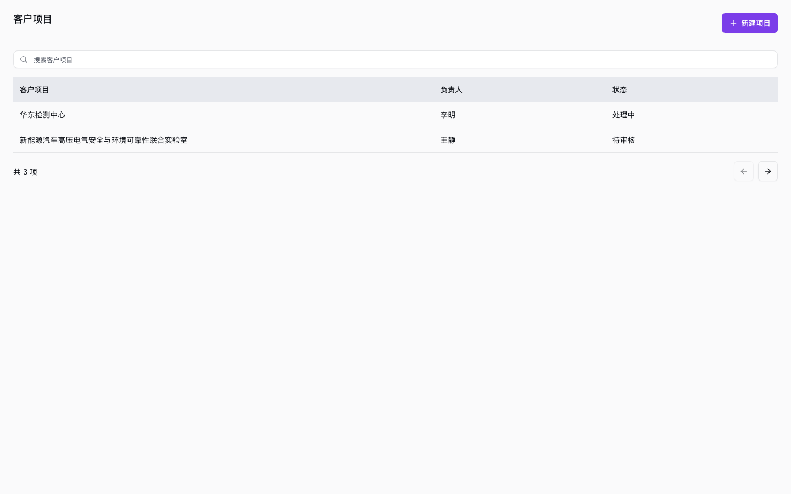
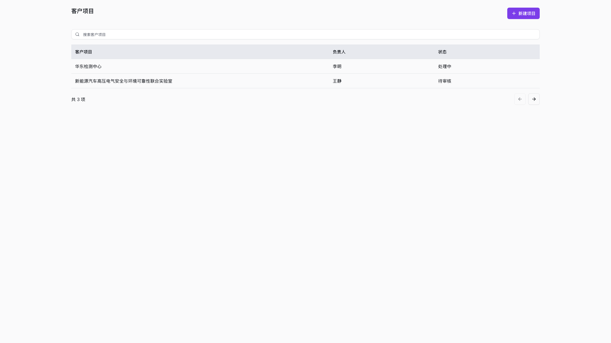

# 页面模式验收

## 范围

帮助业务开发者按页面类型复用布局与组件。提供自定义列表、表单、详情、
工作台、仪表盘样板以及配置页模板；不替换现有资源 CRUD，不更改权限、
后端存储、发布或部署。演示新增与保存仅在当前页面内存中有效。

## 状态矩阵

| 场景 | 证据 |
| --- | --- |
| 五类页面默认布局 | page-pattern.test.svelte.ts |
| 类型切换、显式宽度/密度、详情侧栏 | page-pattern.test.svelte.ts |
| 搜索无结果、清除筛选、分页 | page-pattern.test.svelte.ts |
| 新增后返回列表并检索到记录 | 组件测试和两个桌面视口浏览器交互 |
| 错误重试 | page-pattern.test.svelte.ts |
| 工作台选中切换 | page-pattern.test.svelte.ts |
| 配置修改、保存、撤销 | configuration-page.test.svelte.ts |
| 空、加载、错误、无权限 | Storybook Business Pages 的对应状态 |
| 折叠/展开 | 不适用，本次未增加折叠交互 |

## 验收场景

- Given 自定义列表 When 创建记录并保存 Then 返回列表并能搜索到该记录。
- Given 搜索无结果 When 清除筛选 Then 重新显示列表。
- Given 请求失败 When 点击重试 Then 恢复展示，不提前显示成功状态。
- Given 工作台 When 选择另一项 Then 详情与选中项一致。
- Given 配置被修改 When 保存后继续修改并撤销 Then 恢复最近保存值。

## 截图

使用仓库现有 Playwright Chromium 对本地 Storybook 进行真实浏览器检查。
截图使用合成演示数据，不包含客户信息。截图仅证明所示样板，不代表所有
业务页面已完成迁移或全部视觉验收。

### 1440x900

### 1920x1080

