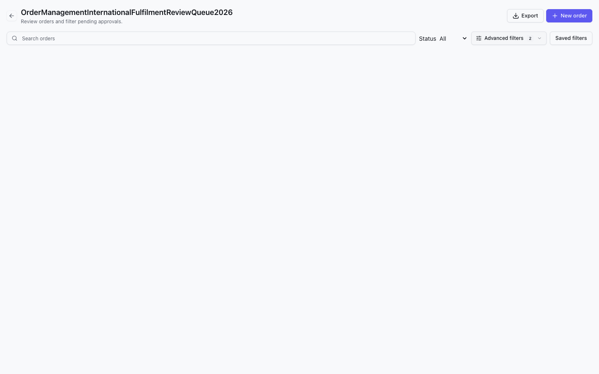
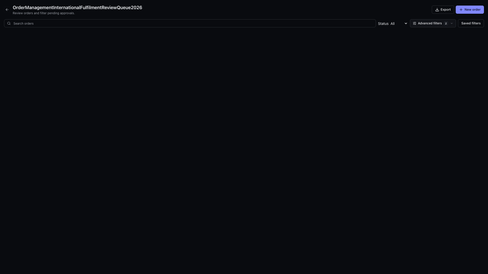

# UI Static CSS Migration

## Scope

Hosts can consume `@svadmin/ui/app.css` without a Tailwind build plugin.
Tailwind hosts use `app.theme.css` to retain semantic theme metadata alongside
the same precompiled styles. Public component props and variant helpers remain
compatible, including array and object class composition.

This is a progressive migration. Tailwind remains a build-time dependency and
974 transitional utility aliases remain in the build map. This change does not
claim a full handwritten-CSS rewrite or modify other packages' styling.

## PM Gate

JTBD: integrate the admin UI into an existing application without adopting a
specific host CSS compiler, while preserving theme overrides and daily workflows.

Anti-goals: no backend, authentication, persistence, package release, or deployment
changes. No redesign of the business workflows.

Information architecture: preserve the existing page header and breadcrumb
hierarchy. Keep advanced filters collapsed until requested and allow actions
and long titles to wrap at narrow widths.

## State Matrix

| Surface | States | Acceptance |
| --- | --- | --- |
| CSS entries | Plain CSS, theme CSS, Tailwind host | Compiled styles and host overrides remain available |
| Page chrome | Light/dark, compact/comfortable | Stable control sizing and readable text |
| Viewports | 1440x900, 1920x1080, 390x900 | No horizontal overflow or overlapping actions |
| Search | Empty, populated, cleared | Two-way query binding remains intact |
| Advanced filters | Collapsed, expanded | Matching region ID and ARIA controls; collapse unmounts panel |
| Navigation | Back action, desktop viewport | Callback runs; viewport honors Bits UI width |
| Alerts | With/without icon | No implicit blank grid column |
| Theme composition | Nested theme, host token override | Local semantic values and host utilities take precedence |
| Failure handling | Invalid migration input | Migration fails before writing files |

## Gherkin Acceptance

```gherkin
Scenario: Consume the UI without a host Tailwind plugin
  Given a Svelte host imports the published plain CSS entry
  When it renders the page header, breadcrumbs, and filter toolbar
  Then all component styles are available without a Tailwind compiler

Scenario: Clear and expand filters
  Given a populated search query and collapsed advanced filters
  When the user clears search and opens advanced filters
  Then the query binding is empty and the controlled region is mounted

Scenario: Preserve host theme customization
  Given a Tailwind host overrides a semantic color token and control utilities
  When the published theme entry is compiled by that host
  Then host styles override defaults and nested semantic themes still work

Scenario: Fail closed on invalid migration input
  Given a component contains invalid Svelte syntax
  When the maintenance migration is invoked
  Then validation fails before any component files are written
```

## Browser Evidence

The screenshots use the real `PageChromeHarness.svelte` fixture, mounted in
Chromium with the published plain CSS entry. Both entries were also checked
across all viewport, density, and theme combinations above.



